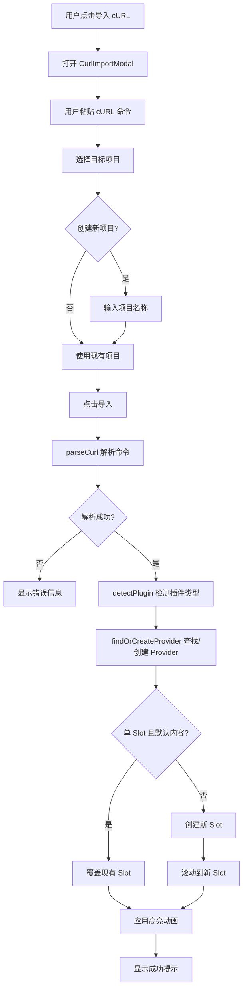

# Design Document: cURL Import Feature

## Overview

本功能为 TruestPrompt 添加"导入 cURL"能力，允许用户通过粘贴 cURL 命令快速创建或更新 Provider 配置，并自动配置 Slot。核心流程：解析 cURL → 检测 Provider 类型 → 创建/复用 Provider → 智能配置 Slot → 动画反馈。

## Architecture



## Components and Interfaces

### 1. CurlImportModal.vue (新组件)

导入 cURL 的模态框组件。

```typescript
// Props
interface CurlImportModalProps {
  open: boolean;
  projects: ProjectMetadata[];
  currentProjectId: string;
}

// Emits
interface CurlImportModalEmits {
  'update:open': [boolean];
  'import': [CurlImportResult];
  'createProject': [string]; // 新项目名称
}

// 内部状态
interface CurlImportModalState {
  curlInput: string;
  targetProjectId: string;
  createNewProject: boolean;
  newProjectName: string;
  importMessages: boolean;
  error: string | null;
  loading: boolean;
}
```

### 2. curlParser.ts (新模块)

cURL 命令解析工具库。

```typescript
// 解析结果
export interface ParsedCurl {
  url: string;
  method: string;
  headers: Record<string, string>;
  body: unknown | null;
  apiKey: string | null;
}

// 导入结果
export interface CurlImportResult {
  targetProjectId: string;
  provider: {
    id: string;
    name: string;
    apiKey: string;
    baseUrl: string;
    pluginId: string;
    isNew: boolean;
  };
  modelId: string | null;
  messages: Array<{ role: string; content: string }> | null;
  systemPrompt: string | null;
}

// 主要函数
export function parseCurl(curlCommand: string): ParsedCurl;
export function detectPluginId(url: string): string;
export function extractApiKey(headers: Record<string, string>): string | null;
export function extractModelAndMessages(body: unknown): {
  modelId: string | null;
  messages: Array<{ role: string; content: string }> | null;
  systemPrompt: string | null;
};
```

### 3. AppToolbar.vue (修改)

添加"导入 cURL"按钮。

```typescript
// 新增 emit
interface AppToolbarEmits {
  // ... 现有 emits
  importCurl: [];
}
```

### 4. App.vue (修改)

添加导入逻辑和 Slot 动画状态。

```typescript
// 新增状态
const showCurlImportModal = ref(false);
const highlightedSlotId = ref<string | null>(null);

// 新增方法
function handleCurlImport(result: CurlImportResult): void;
function isSlotDefault(slot: Slot): boolean;
function highlightSlot(slotId: string): void;
```

### 5. SlotCard.vue (修改)

添加高亮动画支持。

```typescript
// 新增 Props
interface SlotCardProps {
  // ... 现有 props
  highlighted?: boolean;
}
```

## Data Models

### ParsedCurl

```typescript
interface ParsedCurl {
  url: string;           // 请求 URL
  method: string;        // HTTP 方法 (POST)
  headers: Record<string, string>;  // 请求头
  body: unknown | null;  // 解析后的 JSON body
  apiKey: string | null; // 从 Authorization 头提取的 API Key
}
```

### CurlImportResult

```typescript
interface CurlImportResult {
  targetProjectId: string;  // 目标项目 ID
  provider: {
    id: string;
    name: string;
    apiKey: string;
    baseUrl: string;
    pluginId: string;
    isNew: boolean;  // 是否新创建的 Provider
  };
  modelId: string | null;
  messages: Array<{ role: string; content: string }> | null;
  systemPrompt: string | null;
}
```

### Plugin URL Patterns

```typescript
const PLUGIN_URL_PATTERNS: Array<{ pattern: RegExp; pluginId: string }> = [
  { pattern: /api\.openai\.com/i, pluginId: 'openai-compatible' },
  { pattern: /generativelanguage\.googleapis\.com/i, pluginId: 'Gemini' },
  { pattern: /dashscope\.aliyuncs\.com/i, pluginId: 'aliyun-dashscope' },
  { pattern: /api\.moonshot\.cn/i, pluginId: 'kimi-moonshot' },
  { pattern: /ark\.cn-beijing\.volces\.com/i, pluginId: 'ark-bytedance' },
];
```


## Correctness Properties

*A property is a characteristic or behavior that should hold true across all valid executions of a system-essentially, a formal statement about what the system should do. Properties serve as the bridge between human-readable specifications and machine-verifiable correctness guarantees.*

### Property 1: cURL Parsing Extracts All Required Fields

*For any* valid cURL command string containing a URL, headers, and JSON body, parsing the command SHALL extract the correct URL, all headers, and the parsed body object.

**Validates: Requirements 1.4**

### Property 2: Plugin Detection Based on URL Patterns

*For any* URL string, the plugin detection function SHALL return the correct pluginId based on known URL patterns, or default to 'openai-compatible' for unknown patterns.

**Validates: Requirements 2.1, 2.2**

### Property 3: API Key Extraction from Authorization Header

*For any* headers object containing an Authorization header with "Bearer " prefix, the extraction function SHALL return the API key value without the prefix.

**Validates: Requirements 2.3**

### Property 4: Provider Matching by BaseUrl, PluginId and ApiKey

*For any* list of existing Providers and an import configuration, the matching function SHALL return the Provider with matching baseUrl, pluginId and apiKey if one exists, or null otherwise.

**Validates: Requirements 3.1**

### Property 5: Provider Creation with Unique Names

*For any* list of existing Provider names and a base name, the name generation function SHALL produce a unique name that does not conflict with existing names.

**Validates: Requirements 3.3, 3.4**

### Property 6: Slot Overwrite vs Create Decision

*For any* list of Slots, if exactly one Slot exists and it has default content, the import SHALL overwrite that Slot; otherwise, the import SHALL create a new Slot.

**Validates: Requirements 4.1, 4.2**

### Property 7: Model ID Extraction from Request Body

*For any* parsed cURL body containing a "model" field, the extraction function SHALL return the model identifier string.

**Validates: Requirements 4.3**

### Property 8: Error Handling for Invalid Inputs

*For any* invalid cURL input (empty, non-curl prefix, missing URL, malformed), the parser SHALL return an appropriate error object with a descriptive message.

**Validates: Requirements 5.1, 5.2, 5.3, 5.4**

### Property 9: Message Separation by Role

*For any* messages array from a cURL body, the separation function SHALL place system role messages into systemPrompt and user/assistant role messages into userPrompts.

**Validates: Requirements 6.1, 6.2**

## Error Handling

### Parse Errors

| Error Condition | Error Message | Recovery |
|----------------|---------------|----------|
| Empty input | "请输入 cURL 命令" | 用户重新输入 |
| Invalid format | "无效的 cURL 命令格式" | 用户检查格式 |
| Missing URL | "未找到有效的请求 URL" | 用户补充 URL |
| Invalid JSON body | "请求体 JSON 格式无效" | 用户检查 JSON |
| Unknown parse error | "解析失败: {detail}" | 显示详细错误 |

### Import Errors

| Error Condition | Error Message | Recovery |
|----------------|---------------|----------|
| Project creation failed | "创建项目失败" | 用户重试或选择现有项目 |
| Provider save failed | "保存 Provider 失败" | 用户重试 |

## Testing Strategy

### Property-Based Testing

使用 `fast-check` 库进行属性测试。

**测试配置：**
- 每个属性测试运行 100 次迭代
- 使用 `fc.assert` 进行断言
- 每个测试标注对应的 Property 编号

**生成器策略：**

```typescript
// cURL 命令生成器
const curlCommandArb = fc.record({
  url: fc.webUrl(),
  method: fc.constantFrom('POST', 'GET'),
  headers: fc.dictionary(fc.string(), fc.string()),
  body: fc.jsonValue()
}).map(({ url, method, headers, body }) => {
  let cmd = `curl -X ${method}`;
  for (const [k, v] of Object.entries(headers)) {
    cmd += ` -H "${k}: ${v}"`;
  }
  if (body) {
    cmd += ` -d '${JSON.stringify(body)}'`;
  }
  cmd += ` ${url}`;
  return cmd;
});

// Provider 列表生成器
const providerListArb = fc.array(fc.record({
  id: fc.uuid(),
  name: fc.string({ minLength: 1, maxLength: 50 }),
  apiKey: fc.string(),
  baseUrl: fc.webUrl(),
  pluginId: fc.constantFrom('openai-compatible', 'Gemini', 'aliyun-dashscope')
}));

// Messages 数组生成器
const messagesArb = fc.array(fc.record({
  role: fc.constantFrom('system', 'user', 'assistant'),
  content: fc.string()
}));
```

### Unit Tests

**关键测试用例：**

1. `parseCurl` 基本功能测试
   - 解析标准 OpenAI cURL 命令
   - 解析带有多个 header 的命令
   - 解析带有复杂 JSON body 的命令

2. `detectPluginId` 测试
   - 各已知 Provider URL 的检测
   - 未知 URL 默认返回 openai-compatible

3. `extractApiKey` 测试
   - Bearer token 提取
   - 无 Authorization header 返回 null

4. Slot 覆盖/创建逻辑测试
   - 单 Slot 默认内容 → 覆盖
   - 单 Slot 非默认内容 → 新建
   - 多 Slot → 新建

### Integration Tests

1. 完整导入流程测试
   - 从 cURL 到 Slot 配置的端到端测试
   - 项目切换后的导入测试

2. UI 交互测试
   - Modal 打开/关闭
   - 错误提示显示
   - 高亮动画触发
