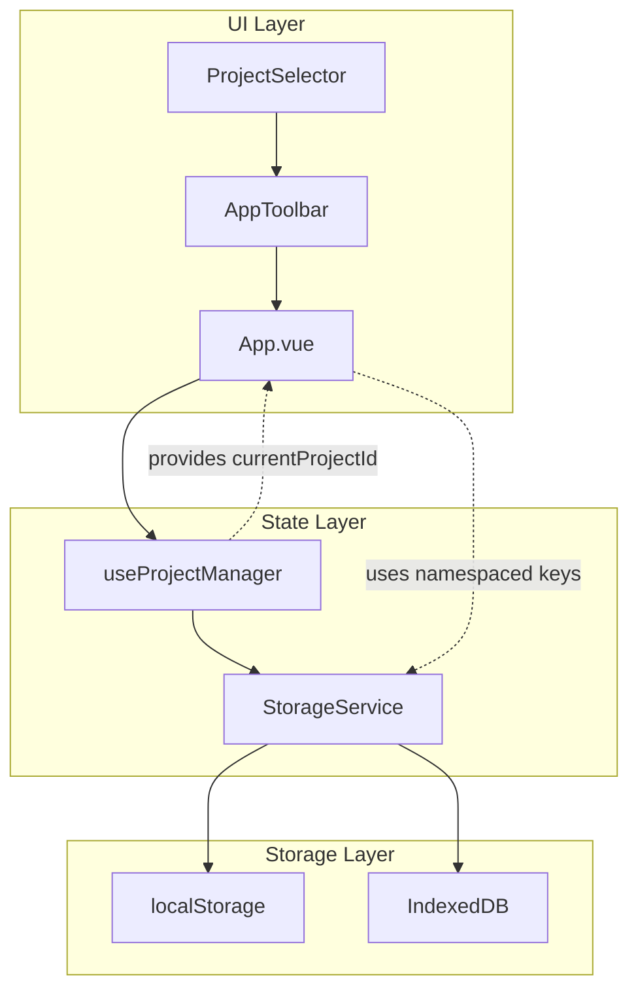

# Design Document: Project Management

## Overview

本设计文档描述 TruestPrompt 的 Project（项目）管理功能实现方案。核心目标是实现多项目数据完全隔离，让用户可以在不同的调试场景间无缝切换，同时保持代码的简洁性和可维护性。

### 设计原则

1. **数据隔离优先** - 通过 Storage Namespace 机制确保项目间数据完全独立
2. **最小侵入性** - 尽量复用现有的存储逻辑，通过抽象层实现隔离
3. **渐进式迁移** - 兼容现有无项目概念的数据，自动迁移到默认项目
4. **故障容错** - 存储异常时提供降级方案，避免数据丢失

## Architecture



### 数据流

1. 用户通过 ProjectSelector 选择/创建/删除项目
2. useProjectManager composable 管理项目元数据和当前活动项目
3. StorageService 根据 currentProjectId 生成命名空间化的存储 key
4. App.vue 中的所有存储操作通过 StorageService 进行，自动获得项目隔离

## Components and Interfaces

### 1. ProjectSelector 组件

位于 AppToolbar 中，提供项目管理的完整 UI。

```typescript
// src/components/layout/ProjectSelector.vue
interface ProjectSelectorProps {
  projects: ProjectMetadata[];
  currentProjectId: string;
}

interface ProjectSelectorEmits {
  'select': [projectId: string];
  'create': [name: string];
  'rename': [projectId: string, newName: string];
  'delete': [projectId: string];
}
```

**UI 结构：**
- 下拉触发器：显示当前项目名称
- 下拉菜单：
  - 项目列表（按最近使用排序）
  - 分隔线
  - "新建项目" 按钮
- 项目项：名称 + 悬停时显示的操作按钮（重命名、删除）
- 新建项目模态框：名称输入 + 确认/取消

### 2. useProjectManager Composable

管理项目的 CRUD 操作和当前活动项目状态。

```typescript
// src/composables/useProjectManager.ts
interface UseProjectManagerReturn {
  // 状态
  projects: Ref<ProjectMetadata[]>;
  currentProjectId: Ref<string>;
  currentProject: ComputedRef<ProjectMetadata | undefined>;
  
  // 操作
  createProject: (name: string) => ProjectMetadata;
  renameProject: (projectId: string, newName: string) => void;
  deleteProject: (projectId: string) => Promise<void>;
  switchProject: (projectId: string) => void;
  
  // 生命周期
  initialize: () => void;
}
```

### 3. StorageService

提供命名空间化的存储访问接口。

```typescript
// src/lib/storage.ts
interface StorageService {
  // 获取当前项目的命名空间化 key
  getKey: (baseKey: string) => string;
  
  // localStorage 操作
  getItem: (baseKey: string) => string | null;
  setItem: (baseKey: string, value: string) => void;
  removeItem: (baseKey: string) => void;
  
  // IndexedDB 实例获取
  getHistoryStore: () => LocalForage;
  getModelCacheStore: () => LocalForage;
  
  // 项目数据清理
  clearProjectData: (projectId: string) => Promise<void>;
}
```

## Data Models

### ProjectMetadata

```typescript
// src/types.ts
interface ProjectMetadata {
  id: string;           // 唯一标识，使用 nanoid 生成
  name: string;         // 项目名称，用户可编辑
  createdAt: number;    // 创建时间戳
  updatedAt: number;    // 最后更新时间戳
}
```

### 存储 Key 命名规范

| 数据类型 | 原始 Key | 命名空间化 Key |
|---------|---------|---------------|
| Provider 配置 | `truestprompt-profiles` | `truestprompt-{projectId}-profiles` |
| 编辑器状态 | `truestprompt-editor-state-v1` | `truestprompt-{projectId}-editor-state-v1` |
| 主题偏好 | `truestprompt-theme` | `truestprompt-theme` (全局) |
| 项目列表 | - | `truestprompt-projects` (全局) |
| 当前项目 | - | `truestprompt-current-project` (全局) |
| 历史记录 | `truestprompt-history` | `truestprompt-history-{projectId}` |
| 模型缓存 | `truestprompt-model-cache` | `truestprompt-model-cache-{projectId}` |

### 默认项目

```typescript
const DEFAULT_PROJECT: ProjectMetadata = {
  id: 'default',
  name: 'Default Project',
  createdAt: 0,
  updatedAt: 0
};
```

## Correctness Properties


*A property is a characteristic or behavior that should hold true across all valid executions of a system-essentially, a formal statement about what the system should do. 
Properties serve as the bridge between human-readable specifications and machine-verifiable correctness guarantees.*

### Property 1: Valid Project Name Creates Project with Unique ID

*For any* valid project name (non-empty, trimmed, max 50 characters), creating a project SHALL produce a project with a unique ID that is different from all existing project IDs.

**Validates: Requirements 1.2**

### Property 2: Whitespace-Only Names Rejected for Creation

*For any* string composed entirely of whitespace characters (including empty string), attempting to create a project SHALL be rejected and the project list SHALL remain unchanged.

**Validates: Requirements 1.3**

### Property 3: New Projects Start with Empty State

*For any* newly created project, the initial state SHALL have zero providers, default editor state (single slot, default prompts), and zero history items.

**Validates: Requirements 1.4**

### Property 4: Project Switch Round-Trip Preserves State

*For any* project with saved state, switching to another project and then switching back SHALL restore the exact same state (providers, editor state).

**Validates: Requirements 2.1**

### Property 5: Project Data Loads Correctly After Switch

*For any* project switch operation, the loaded providers, slots, and prompts SHALL match the data that was previously saved for that project.

**Validates: Requirements 2.2**

### Property 6: Last Active Project Restored on Init

*For any* application initialization, the currentProjectId SHALL equal the projectId that was active when the application was last closed.

**Validates: Requirements 2.4**

### Property 7: Valid Rename Updates and Persists

*For any* valid new name (non-empty, trimmed, max 50 characters), renaming a project SHALL update the project's name in the projects list and persist to storage.

**Validates: Requirements 3.2**

### Property 8: Whitespace-Only Names Rejected for Rename

*For any* string composed entirely of whitespace characters, attempting to rename a project SHALL be rejected and the project's original name SHALL be preserved.

**Validates: Requirements 3.3**

### Property 9: Project Deletion Removes All Storage Data

*For any* deleted project, all associated storage keys (providers, editor state) and IndexedDB instances (history, model cache) SHALL be removed.

**Validates: Requirements 4.2**

### Property 10: Deleting Active Project Switches to Default

*For any* deletion of the currently active project, the currentProjectId SHALL automatically change to 'default'.

**Validates: Requirements 4.3**

### Property 11: Storage Deletion Failure Preserves Project

*For any* project deletion that encounters a storage error, the project SHALL remain in the projects list and its data SHALL be preserved.

**Validates: Requirements 4.5**

### Property 12: Storage Keys Namespaced by Project ID

*For any* project ID and storage operation (providers, editor state, history, model cache), the storage key or instance name SHALL contain the project ID as a namespace prefix.

**Validates: Requirements 5.1, 5.2, 5.3, 5.4**

### Property 13: Theme Storage Key is Global

*For any* theme storage operation, the storage key SHALL NOT contain any project ID and SHALL be the same regardless of current project.

**Validates: Requirements 5.5**

### Property 14: Projects Sorted by Last Used Time

*For any* list of projects with different updatedAt timestamps, the sorted list SHALL have projects ordered by updatedAt descending (most recent first).

**Validates: Requirements 6.2**

## Error Handling

| 错误场景 | 处理策略 | 用户反馈 |
|---------|---------|---------|
| localStorage 不可用 | 降级到内存模式 | Toast 警告 "本地存储不可用，数据不会持久化" |
| localStorage 配额超限 | 尝试清理旧数据，若失败则降级 | Toast 警告 "存储空间不足" |
| IndexedDB 操作失败 | 重试一次，失败后降级到 localStorage | Console 日志 + Toast 警告 |
| 项目名称验证失败 | 阻止操作，显示内联错误 | 输入框下方红色错误提示 |
| 删除默认项目 | 阻止操作 | Toast 提示 "默认项目不可删除" |
| 项目数据加载失败 | 使用默认空状态 | Toast 警告 "项目数据加载失败，已重置为默认状态" |

### 数据迁移策略

对于现有无项目概念的数据，系统启动时执行一次性迁移：

1. 检测是否存在旧格式的存储 key（无项目前缀）
2. 如果存在，将数据复制到 `default` 项目的命名空间下
3. 保留原始 key 作为备份（可选：在确认迁移成功后删除）
4. 标记迁移完成，避免重复执行

```typescript
async function migrateToProjectNamespace(): Promise<void> {
  const migrationKey = 'truestprompt-migration-v1';
  if (localStorage.getItem(migrationKey)) return;
  
  // 迁移 profiles
  const oldProfiles = localStorage.getItem('truestprompt-profiles');
  if (oldProfiles) {
    localStorage.setItem('truestprompt-default-profiles', oldProfiles);
  }
  
  // 迁移 editor state
  const oldEditorState = localStorage.getItem('truestprompt-editor-state-v1');
  if (oldEditorState) {
    localStorage.setItem('truestprompt-default-editor-state-v1', oldEditorState);
  }
  
  // 迁移 IndexedDB (history, model-cache)
  // ... IndexedDB 迁移逻辑
  
  localStorage.setItem(migrationKey, Date.now().toString());
}
```

## Testing Strategy

### 单元测试

使用 Vitest 进行单元测试，覆盖以下场景：

1. **useProjectManager composable**
   - 项目 CRUD 操作
   - 项目切换逻辑
   - 初始化和持久化

2. **StorageService**
   - Key 命名空间化
   - 存储操作封装
   - 错误处理

3. **项目名称验证**
   - 有效名称通过
   - 空/空白名称拒绝
   - 长度限制

### 属性测试

使用 fast-check 进行属性测试，验证 Correctness Properties 中定义的所有属性。

**测试配置：**
- 每个属性测试运行 100 次迭代
- 使用 `fc.string()` 生成随机项目名称
- 使用 `fc.record()` 生成随机项目状态

**测试标注格式：**
```typescript
// **Feature: project-management, Property 1: Valid Project Name Creates Project with Unique ID**
// **Validates: Requirements 1.2**
```

### 集成测试

1. 完整的项目切换流程
2. 数据迁移验证
3. 存储降级场景

