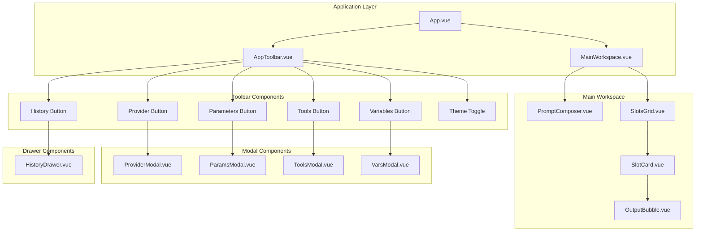

# Design Document: TruestPrompt UI Redesign

## Overview

本设计文档描述 TruestPrompt 前端 UI 重构的技术方案。采用 LangUI 的 AI 对话组件风格和 Ant Design Vue 组件库，实现一个简洁、现代、动画流畅的大模型调试台界面。

**核心设计理念：**
- 简化布局：去掉左右侧边栏，采用顶部工具栏驱动模式
- 主页面专注：Prompt 调试（编写和修改文案）为核心
- 模态框配置：所有配置项通过工具栏按钮打开模态框/抽屉
- 流畅动画：丰富的微交互提升用户体验

## Architecture

### 整体架构图



### 页面布局原型图

```
┌─────────────────────────────────────────────────────────────────────────────┐
│  ┌─────────────────────────────────────────────────────────────────────────┐│
│  │ 🔷 TruestPrompt    [Project ▼]  │  [Provider] [Params] [Tools] [Vars]  ││
│  │                                 │  [History] [🌙]                       ││
│  └─────────────────────────────────────────────────────────────────────────┘│
│                                    TOOLBAR                                   │
├─────────────────────────────────────────────────────────────────────────────┤
│                                                                             │
│  ┌─────────────────────────────────────────────────────────────────────┐   │
│  │  📝 Prompt Composer                                    [+ Add Msg]  │   │
│  │  ┌───────────────────────────────────────────────────────────────┐  │   │
│  │  │ [user ▼]  Hello, please help me with...              [🗑️]    │  │   │
│  │  └───────────────────────────────────────────────────────────────┘  │   │
│  │  ┌───────────────────────────────────────────────────────────────┐  │   │
│  │  │ [assistant ▼]  Sure, I'd be happy to help...         [🗑️]    │  │   │
│  │  └───────────────────────────────────────────────────────────────┘  │   │
│  └─────────────────────────────────────────────────────────────────────┘   │
│                                                                             │
│  ┌─────────────────────────────────────────────────────────────────────┐   │
│  │  🎰 Slots Lab                                          [+ Add Slot] │   │
│  │  ┌─────────────────────────┐  ┌─────────────────────────┐          │   │
│  │  │ [Provider ▼] [Model ▼] │  │ [Provider ▼] [Model ▼] │          │   │
│  │  │ ┌─────────────────────┐ │  │ ┌─────────────────────┐ │          │   │
│  │  │ │ System Prompt...    │ │  │ │ System Prompt...    │ │          │   │
│  │  │ └─────────────────────┘ │  │ └─────────────────────┘ │          │   │
│  │  │ [▶ Run] [📋 Copy] [🗑️] │  │ [▶ Run] [📋 Copy] [🗑️] │          │   │
│  │  │ ┌─────────────────────┐ │  │ ┌─────────────────────┐ │          │   │
│  │  │ │ 💬 Output bubble... │ │  │ │ 💬 Output bubble... │ │          │   │
│  │  │ │ TTFB: 120ms         │ │  │ │ TTFB: 95ms          │ │          │   │
│  │  │ └─────────────────────┘ │  │ └─────────────────────┘ │          │   │
│  │  └─────────────────────────┘  └─────────────────────────┘          │   │
│  └─────────────────────────────────────────────────────────────────────┘   │
│                                                                             │
└─────────────────────────────────────────────────────────────────────────────┘
```
###
 模态框原型图

#### Provider 管理模态框
```
┌─────────────────────────────────────────────────────────────┐
│  Provider 管理                                         [✕]  │
├─────────────────────────────────────────────────────────────┤
│                                                             │
│  已保存的 Provider                                          │
│  ┌─────────────────────────────────────────────────────┐   │
│  │ 🔵 OpenAI GPT-4    api.openai.com     [编辑] [删除] │   │
│  │ 🟢 Claude API      api.anthropic.com  [编辑] [删除] │   │
│  │ 🟡 Moonshot        api.moonshot.cn    [编辑] [删除] │   │
│  └─────────────────────────────────────────────────────┘   │
│                                                             │
│  添加新 Provider                                            │
│  ┌─────────────────────────────────────────────────────┐   │
│  │ 名称:     [________________________]                 │   │
│  │ 插件:     [OpenAI Compatible ▼    ]                 │   │
│  │ Base URL: [https://api.openai.com/v1]               │   │
│  │ API Key:  [••••••••••••••••••••••••]                │   │
│  └─────────────────────────────────────────────────────┘   │
│                                                             │
│  [📤 导出] [📥 导入]                          [取消] [保存] │
└─────────────────────────────────────────────────────────────┘
```

#### Parameters 配置模态框
```
┌─────────────────────────────────────────────────────────────┐
│  默认参数配置                                          [✕]  │
├─────────────────────────────────────────────────────────────┤
│                                                             │
│  Temperature                                                │
│  ┌─────────────────────────────────────────────────────┐   │
│  │ [0.7                                            ]   │   │
│  │ ○────────────●──────────────────────────────────○   │   │
│  │ 0                                               2   │   │
│  └─────────────────────────────────────────────────────┘   │
│                                                             │
│  Top P                                                      │
│  ┌─────────────────────────────────────────────────────┐   │
│  │ [1.0                                            ]   │   │
│  └─────────────────────────────────────────────────────┘   │
│                                                             │
│  Max Tokens                                                 │
│  ┌─────────────────────────────────────────────────────┐   │
│  │ [8192                                           ]   │   │
│  └─────────────────────────────────────────────────────┘   │
│                                                             │
│  [恢复默认]                                   [取消] [保存] │
└─────────────────────────────────────────────────────────────┘
```
###
# Tools 配置模态框
```
┌─────────────────────────────────────────────────────────────┐
│  Tools 定义                                            [✕]  │
├─────────────────────────────────────────────────────────────┤
│  ┌─────────────────────────────────────────────────────┐   │
│  │ 1  [                                               │   │
│  │ 2    {                                             │   │
│  │ 3      "type": "function",                         │   │
│  │ 4      "function": {                               │   │
│  │ 5        "name": "fetchDocs",                      │   │
│  │ 6        "description": "Query project docs",      │   │
│  │ 7        "parameters": {                           │   │
│  │ 8          "type": "object",                       │   │
│  │ 9          "properties": {}                        │   │
│  │10        }                                         │   │
│  │11      }                                           │   │
│  │12    }                                             │   │
│  │13  ]                                               │   │
│  └─────────────────────────────────────────────────────┘   │
│  ✅ JSON 格式正确                                           │
│                                                             │
│  [格式化]                                     [取消] [保存] │
└─────────────────────────────────────────────────────────────┘
```

#### Variables 配置模态框
```
┌─────────────────────────────────────────────────────────────┐
│  模板变量                                              [✕]  │
├─────────────────────────────────────────────────────────────┤
│                                                             │
│  使用 {{变量名}} 在 Prompt 中引用变量                        │
│                                                             │
│  ┌─────────────────────────────────────────────────────┐   │
│  │ Key              │ Value                     │ 操作 │   │
│  ├──────────────────┼───────────────────────────┼──────┤   │
│  │ [USER_NAME     ] │ [张三                   ] │ [🗑️] │   │
│  │ [PROJECT_ID    ] │ [proj-12345             ] │ [🗑️] │   │
│  │ [API_VERSION   ] │ [v2                     ] │ [🗑️] │   │
│  └─────────────────────────────────────────────────────┘   │
│                                                             │
│  [+ 添加变量]                                 [取消] [保存] │
└─────────────────────────────────────────────────────────────┘
```
###
# History 抽屉
```
┌─────────────────────────────────────────────────────────────┐
│  运行历史                                              [✕]  │
├─────────────────────────────────────────────────────────────┤
│  🔍 [搜索历史记录...                                    ]   │
│                                                             │
│  今天                                                       │
│  ┌─────────────────────────────────────────────────────┐   │
│  │ ⭐ 14:32  GPT-4o  "帮我写一个函数..."                │   │
│  │    TTFB: 120ms | 总耗时: 2.3s | Tokens: 156/423     │   │
│  │    [展开详情] [载入] [删除]                          │   │
│  ├─────────────────────────────────────────────────────┤   │
│  │ ☆ 13:15  Claude-3  "分析这段代码..."                │   │
│  │    TTFB: 95ms | 总耗时: 1.8s | Tokens: 89/312       │   │
│  │    [展开详情] [载入] [删除]                          │   │
│  └─────────────────────────────────────────────────────┘   │
│                                                             │
│  昨天                                                       │
│  ┌─────────────────────────────────────────────────────┐   │
│  │ ☆ 18:45  GPT-4  "解释这个概念..."                   │   │
│  │    TTFB: 150ms | 总耗时: 3.1s | Tokens: 234/567     │   │
│  │    [展开详情] [载入] [删除]                          │   │
│  └─────────────────────────────────────────────────────┘   │
│                                                             │
└─────────────────────────────────────────────────────────────┘
```

### Slot 卡片详细原型图

```
┌─────────────────────────────────────────────────────────────┐
│ ▓▓▓▓▓▓▓▓▓▓▓▓▓▓▓▓▓▓▓▓▓▓▓▓▓▓▓▓▓▓▓▓▓▓▓▓▓▓▓▓▓▓▓▓▓▓▓▓▓▓▓▓▓▓▓▓▓ │  ← 运行进度条
├─────────────────────────────────────────────────────────────┤
│  [OpenAI GPT-4 ▼]              [gpt-4o-mini ▼] [🔄]        │
├─────────────────────────────────────────────────────────────┤
│  System Prompt                                              │
│  ┌─────────────────────────────────────────────────────┐   │
│  │ You are a helpful assistant focused on prompt       │   │
│  │ debugging insights. Please analyze the user's       │   │
│  │ request and provide detailed feedback.              │   │
│  │                                                     │   │
│  │                                                     │   │
│  └─────────────────────────────────────────────────────┘   │
├─────────────────────────────────────────────────────────────┤
│  [▶ 运行]  [📋 复制 Slot]  [📤 导出 cURL]  [🗑️ 删除]      │
├─────────────────────────────────────────────────────────────┤
│  💬 输出                                                    │
│  ┌─────────────────────────────────────────────────────┐   │
│  │  ╭──────────────────────────────────────────────╮   │   │
│  │  │ 好的，我来帮你分析这个问题。                  │   │   │
│  │  │                                              │   │   │
│  │  │ 首先，让我们看看代码的结构...                │   │   │
│  │  │ █                                            │   │   │  ← 流式光标
│  │  ╰──────────────────────────────────────────────╯   │   │
│  │                                                     │   │
│  │  [TTFB 120ms] [耗时 2.3s] [Tokens 156/423]  [📋]   │   │
│  └─────────────────────────────────────────────────────┘   │
│                                                             │
│  🔧 Tool Calls                                    [展开 ▼] │
│  ┌─────────────────────────────────────────────────────┐   │
│  │ fetchDocs({ "query": "vue composition api" })       │   │
│  └─────────────────────────────────────────────────────┘   │
└─────────────────────────────────────────────────────────────┘
```
## Co
mponents and Interfaces

### 组件层级结构

```
src/
├── App.vue                      # 根组件
├── components/
│   ├── layout/
│   │   ├── AppToolbar.vue       # 顶部工具栏
│   │   └── MainWorkspace.vue    # 主工作区容器
│   ├── prompt/
│   │   ├── PromptComposer.vue   # Prompt 编辑器
│   │   └── MessageItem.vue      # 单条消息组件
│   ├── slots/
│   │   ├── SlotsGrid.vue        # Slot 网格容器
│   │   ├── SlotCard.vue         # Slot 卡片
│   │   └── OutputBubble.vue     # 输出气泡组件
│   ├── modals/
│   │   ├── ProviderModal.vue    # Provider 管理模态框
│   │   ├── ParamsModal.vue      # 参数配置模态框
│   │   ├── ToolsModal.vue       # Tools 配置模态框
│   │   └── VarsModal.vue        # 变量配置模态框
│   ├── drawers/
│   │   └── HistoryDrawer.vue    # 历史记录抽屉
│   └── common/
│       ├── JsonEditor.vue       # JSON 编辑器
│       └── MetricsBadge.vue     # 指标徽章
├── composables/
│   ├── useTheme.ts              # 主题管理
│   ├── useModals.ts             # 模态框状态管理
│   └── useAnimation.ts          # 动画工具
└── styles/
    ├── theme.css                # 主题变量
    ├── animations.css           # 动画定义
    └── langui.css               # LangUI 风格样式
```

### 核心接口定义

```typescript
// 工具栏按钮配置
interface ToolbarButton {
  key: string;
  icon: string;
  label: string;
  onClick: () => void;
  badge?: number | string;
}

// 模态框状态
interface ModalState {
  provider: boolean;
  params: boolean;
  tools: boolean;
  vars: boolean;
}

// 动画配置
interface AnimationConfig {
  duration: number;
  easing: string;
  delay?: number;
}
```
## Data M
odels

### 现有数据模型（保持兼容）

```typescript
// Slot 数据模型
interface Slot {
  id: string;
  providerProfileId: string | null;
  pluginId: string;
  modelId: string;
  systemPrompt: string;
  paramOverride: Record<string, unknown> | null;
  status: 'idle' | 'running' | 'done' | 'error' | 'canceled';
  output: string;
  toolCalls: ToolCall[] | null;
  metrics: {
    ttfbMs: number | null;
    totalMs: number | null;
    tokens?: { prompt?: number; completion?: number; total?: number };
  };
}

// Provider Profile 数据模型
interface ProviderProfile {
  id: string;
  name: string;
  apiKey: string;
  baseUrl: string;
  pluginId: string;
}

// Shared State 数据模型
interface SharedState {
  userPrompts: UserPromptPreset[];
  toolsDefinition: string;
  variables: Variable[];
  defaultParams: {
    temperature: number;
    top_p: number;
    max_tokens: number;
  };
  enableSuggestions: boolean;
  streamOutput: boolean;
}

// 用户消息预设
interface UserPromptPreset {
  id: string;
  role: 'user' | 'system' | 'assistant';
  text: string;
}

// 变量定义
interface Variable {
  id: string;
  key: string;
  value: string;
}
```

### UI 状态模型

```typescript
// 模态框状态
interface UIState {
  modals: {
    provider: boolean;
    params: boolean;
    tools: boolean;
    vars: boolean;
  };
  drawers: {
    history: boolean;
  };
  theme: 'light' | 'dark';
}
```
## Co
rrectness Properties

*A property is a characteristic or behavior that should hold true across all valid executions of a system-essentially, a formal statement about what the system should do. Properties serve as the bridge between human-readable specifications and machine-verifiable correctness guarantees.*

Based on the prework analysis, the following correctness properties have been identified:

### Property 1: Responsive Layout Adaptation
*For any* viewport width change, the main content area width SHALL adjust proportionally while maintaining minimum usable width of 320px.
**Validates: Requirements 1.5**

### Property 2: Theme Persistence Round Trip
*For any* theme toggle action, saving to localStorage and then loading on next application start SHALL restore the same theme state.
**Validates: Requirements 2.7, 11.1**

### Property 3: Provider Selection Updates Model Options
*For any* provider selection in a Slot, the model dropdown options SHALL be updated to reflect only models available for that provider.
**Validates: Requirements 3.2**

### Property 4: Slot Addition Preserves Existing Slots
*For any* Add Slot action, the existing Slots SHALL remain unchanged and a new Slot with default configuration SHALL be appended.
**Validates: Requirements 3.6**

### Property 5: Slot Copy Creates Independent Duplicate
*For any* Slot copy action, the new Slot SHALL have identical configuration to the source but a unique ID, and modifications to either SHALL NOT affect the other.
**Validates: Requirements 3.7**

### Property 6: Slot Deletion Constraint
*For any* Slot delete action, the deletion SHALL only succeed if more than one Slot exists, preventing empty state.
**Validates: Requirements 3.8**

### Property 7: Streaming Output Incremental Append
*For any* streaming output chunk received, the output text SHALL be appended without losing previously received content.
**Validates: Requirements 4.2**

### Property 8: Message Addition Preserves Order
*For any* Add Message action in Prompt Composer, existing messages SHALL maintain their order and a new message SHALL be appended at the end.
**Validates: Requirements 5.2**

### Property 9: Message Reorder via Drag-Drop
*For any* drag-and-drop reorder action, the message list SHALL reflect the new order with all messages preserved.
**Validates: Requirements 5.4**

### Property 10: Message Deletion Constraint
*For any* message delete action, the deletion SHALL only succeed if more than one message exists.
**Validates: Requirements 5.5**

### Property 11: Auto-Save to LocalStorage
*For any* message content edit, the changes SHALL be persisted to localStorage within the specified timeout.
**Validates: Requirements 5.6**

### Property 12: Parameter Validation
*For any* parameter input (temperature, top_p, max_tokens), the system SHALL validate that values are numeric and within acceptable ranges.
**Validates: Requirements 6.2**

### Property 13: JSON Syntax Validation
*For any* JSON input in Tools editor, the system SHALL correctly identify valid and invalid JSON syntax.
**Validates: Requirements 7.2**

### Property 14: JSON Format Idempotence
*For any* valid JSON, formatting it multiple times SHALL produce the same result.
**Validates: Requirements 7.3**

### Property 15: Invalid JSON Prevents Save
*For any* invalid JSON in Tools editor, the Save action SHALL be blocked and an error message displayed.
**Validates: Requirements 7.5**

### Property 16: Variable Addition Creates Empty Pair
*For any* Add Variable action, a new key-value pair with empty strings SHALL be created.
**Validates: Requirements 8.2**

### Property 17: Variable Edit Real-Time Update
*For any* variable key or value edit, the change SHALL be reflected immediately in the UI state.
**Validates: Requirements 8.3**

### Property 18: Variable Deletion Removes Entry
*For any* variable delete action, the variable SHALL be removed from the list.
**Validates: Requirements 8.4**

### Property 19: History Star Toggle
*For any* star toggle action on a history item, the star status SHALL be inverted and persisted.
**Validates: Requirements 9.3**

### Property 20: History Search Filtering
*For any* search query in history, the displayed items SHALL only include those matching the query by keyword, model, or provider.
**Validates: Requirements 9.5**

### Property 21: Provider Form Validation
*For any* provider form submission, the Save button SHALL only be enabled when all required fields (name, API key, base URL) are filled.
**Validates: Requirements 10.2**

### Property 22: Tab Focus Order
*For any* Tab key press, focus SHALL move to the next interactive element in DOM order.
**Validates: Requirements 12.1**

### Property 23: Escape Closes Modal
*For any* Escape key press while a modal is open, the modal SHALL close.
**Validates: Requirements 12.3**

### Property 24: ARIA Labels Present
*For any* interactive element, an appropriate ARIA label SHALL be present for screen reader accessibility.
**Validates: Requirements 12.4**

### Property 25: Modal Focus Trap
*For any* Tab navigation while a modal is open, focus SHALL remain within the modal boundaries.
**Validates: Requirements 12.5**
## Er
ror Handling

### 错误处理策略

| 错误类型 | 处理方式 | 用户反馈 |
|---------|---------|---------|
| API 调用失败 | 捕获异常，更新 Slot 状态为 error | Toast 通知 + Slot 卡片显示错误信息 |
| JSON 解析错误 | 实时校验，阻止保存 | 编辑器内联错误提示 |
| localStorage 不可用 | 降级处理，仅内存存储 | 警告 Toast，提示数据不会持久化 |
| 网络超时 | AbortController 中断 | Slot 状态显示 "已中止" |
| 模型列表加载失败 | 使用缓存或显示空列表 | 下拉框显示 "加载失败，点击重试" |
| Provider 配置无效 | 表单校验阻止提交 | 表单字段显示错误提示 |

### 错误边界

```typescript
// 全局错误处理
const errorHandler = {
  // API 错误
  handleApiError(error: Error, slotId: string) {
    const slot = slots.value.find(s => s.id === slotId);
    if (slot) {
      slot.status = 'error';
      slot.output = error.message;
    }
    showToast({ type: 'error', message: `调用失败: ${error.message}` });
  },
  
  // 存储错误
  handleStorageError(error: Error) {
    console.warn('存储操作失败:', error);
    showToast({ type: 'warning', message: '本地存储不可用，数据将不会持久化' });
  },
  
  // 校验错误
  handleValidationError(field: string, message: string) {
    return { field, message };
  }
};
```

## Testing Strategy

### 单元测试

使用 Vitest 进行单元测试，覆盖以下场景：

- **组件渲染测试**: 验证组件正确渲染预期的 DOM 结构
- **事件处理测试**: 验证点击、输入等事件触发正确的行为
- **状态管理测试**: 验证状态变更正确反映到 UI

### 属性测试

使用 fast-check 进行属性测试，验证以下属性：

- **Property 2**: 主题持久化往返测试
- **Property 4-6**: Slot 增删复制操作测试
- **Property 7**: 流式输出追加测试
- **Property 8-10**: 消息列表操作测试
- **Property 12-15**: 参数和 JSON 校验测试
- **Property 16-18**: 变量操作测试
- **Property 19-20**: 历史记录操作测试

### 测试框架配置

```typescript
// vitest.config.ts
import { defineConfig } from 'vitest/config';
import vue from '@vitejs/plugin-vue';

export default defineConfig({
  plugins: [vue()],
  test: {
    environment: 'jsdom',
    globals: true,
    coverage: {
      provider: 'v8',
      reporter: ['text', 'json', 'html']
    }
  }
});
```

### 属性测试示例

```typescript
// 使用 fast-check 进行属性测试
import * as fc from 'fast-check';
import { describe, it, expect } from 'vitest';

describe('Slot Operations', () => {
  // Property 4: Slot Addition Preserves Existing Slots
  it('adding a slot preserves existing slots', () => {
    fc.assert(
      fc.property(
        fc.array(fc.record({ id: fc.uuid(), modelId: fc.string() })),
        (existingSlots) => {
          const before = [...existingSlots];
          const after = addSlot(existingSlots);
          
          // All existing slots should be preserved
          expect(after.slice(0, before.length)).toEqual(before);
          // New slot should be appended
          expect(after.length).toBe(before.length + 1);
        }
      )
    );
  });
});
```

## Animation Specifications

### 动画时间曲线

```css
:root {
  /* 缓动函数 */
  --ease-out-expo: cubic-bezier(0.16, 1, 0.3, 1);
  --ease-out-back: cubic-bezier(0.34, 1.56, 0.64, 1);
  --ease-in-out: cubic-bezier(0.4, 0, 0.2, 1);
  
  /* 动画时长 */
  --duration-fast: 150ms;
  --duration-normal: 200ms;
  --duration-slow: 300ms;
  --duration-drawer: 250ms;
}
```

### 模态框动画

```css
/* 模态框进入 */
.modal-enter-active {
  animation: modal-in var(--duration-normal) var(--ease-out-expo);
}

@keyframes modal-in {
  from {
    opacity: 0;
    transform: scale(0.95) translateY(-10px);
  }
  to {
    opacity: 1;
    transform: scale(1) translateY(0);
  }
}

/* 模态框离开 */
.modal-leave-active {
  animation: modal-out var(--duration-fast) var(--ease-in-out);
}

@keyframes modal-out {
  from {
    opacity: 1;
    transform: scale(1);
  }
  to {
    opacity: 0;
    transform: scale(0.95);
  }
}
```

### 抽屉动画

```css
/* 抽屉进入 */
.drawer-enter-active {
  animation: drawer-in var(--duration-drawer) var(--ease-out-expo);
}

@keyframes drawer-in {
  from {
    transform: translateX(100%);
  }
  to {
    transform: translateX(0);
  }
}
```

### 按钮微交互

```css
.btn-interactive {
  transition: transform var(--duration-fast) var(--ease-out-expo),
              box-shadow var(--duration-fast) var(--ease-out-expo);
}

.btn-interactive:hover {
  transform: scale(1.02);
  box-shadow: 0 4px 12px rgba(0, 0, 0, 0.15);
}

.btn-interactive:active {
  transform: scale(0.98);
}
```

### 流式输出光标

```css
.streaming-cursor::after {
  content: '█';
  animation: blink 1s step-end infinite;
}

@keyframes blink {
  50% { opacity: 0; }
}
```

### 卡片布局过渡

```css
.slot-grid {
  display: grid;
  gap: 16px;
}

.slot-card {
  transition: all var(--duration-normal) var(--ease-out-expo);
}

/* 卡片进入 */
.slot-enter-active {
  animation: card-in var(--duration-normal) var(--ease-out-back);
}

@keyframes card-in {
  from {
    opacity: 0;
    transform: scale(0.9);
  }
  to {
    opacity: 1;
    transform: scale(1);
  }
}

/* 卡片离开 */
.slot-leave-active {
  animation: card-out var(--duration-fast) var(--ease-in-out);
}

@keyframes card-out {
  from {
    opacity: 1;
    transform: scale(1);
  }
  to {
    opacity: 0;
    transform: scale(0.9);
  }
}
```

### Toast 通知动画

```css
.toast-enter-active {
  animation: toast-in var(--duration-normal) var(--ease-out-back);
}

@keyframes toast-in {
  from {
    opacity: 0;
    transform: translateY(-20px) scale(0.95);
  }
  70% {
    transform: translateY(5px) scale(1.02);
  }
  to {
    opacity: 1;
    transform: translateY(0) scale(1);
  }
}
```

## LangUI + Ant Design Vue 风格融合

### 设计原则

1. **LangUI 负责对话相关组件**: 输出气泡、消息列表、流式光标
2. **Ant Design Vue 负责表单和布局**: 按钮、输入框、选择器、模态框、抽屉

### 颜色系统

```css
:root {
  /* LangUI 对话气泡颜色 */
  --bubble-user-bg: #e3f2fd;
  --bubble-assistant-bg: #f5f5f5;
  --bubble-system-bg: #fff3e0;
  
  /* Ant Design Vue 主色 */
  --primary-color: #1890ff;
  --success-color: #52c41a;
  --warning-color: #faad14;
  --error-color: #ff4d4f;
  
  /* 暗色主题 */
  [data-theme="dark"] {
    --bubble-user-bg: #1a365d;
    --bubble-assistant-bg: #2d3748;
    --bubble-system-bg: #744210;
  }
}
```

### 组件样式映射

| 功能 | 使用组件 | 来源 |
|-----|---------|-----|
| 工具栏按钮 | a-button | Ant Design Vue |
| 下拉选择 | a-select | Ant Design Vue |
| 输入框 | a-input, a-textarea | Ant Design Vue |
| 模态框 | a-modal | Ant Design Vue |
| 抽屉 | a-drawer | Ant Design Vue |
| 输出气泡 | 自定义 (LangUI 风格) | LangUI CSS |
| 消息列表 | 自定义 (LangUI 风格) | LangUI CSS |
| 指标徽章 | a-tag | Ant Design Vue |
| 进度条 | a-progress | Ant Design Vue |
| Toast | a-message | Ant Design Vue |

### 输出气泡样式 (LangUI 风格)

```css
.output-bubble {
  max-width: 85%;
  padding: 12px 16px;
  border-radius: 18px;
  border-bottom-left-radius: 4px;
  background: var(--bubble-assistant-bg);
  font-size: 14px;
  line-height: 1.6;
  white-space: pre-wrap;
  word-break: break-word;
}

.output-bubble--user {
  background: var(--bubble-user-bg);
  border-bottom-left-radius: 18px;
  border-bottom-right-radius: 4px;
  margin-left: auto;
}
```